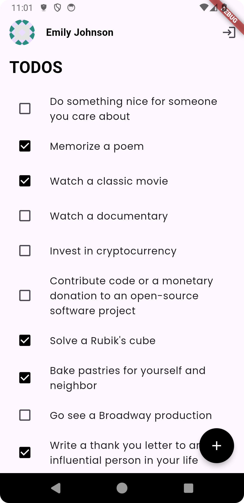
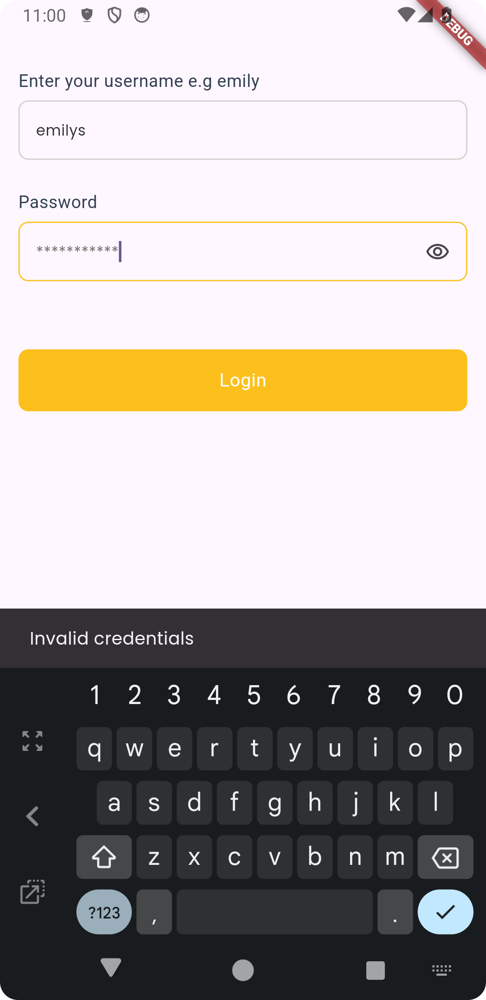

# simontaskmanager

A clean architecture Flutter application built using Bloc, Dio, and shared_preferences.

##

This project was meant as an assessment for me but i had so much fun doing it that i really learnt a
lot, if i had more time i would have worked more on the ui design lol,

## Architecture

This project is built using Clean Architecture together with Test Driven Development (TDD). I chose
this architecture because it makes code easier to write, maintain, and scale. Below is a detailed
explanation of the components and flow of the architecture:

### Key Features

## Architecture Features

- **Clean Architecture:** The app is structured following Clean Architecture principles.
- **Test Driven Development (TDD):** Tests are written before the concrete implementations of
  classes, ensuring a high level of code reliability.
- **Dependency Inversion:** The project follows dependency inversion principles, making the codebase
  flexible and easier to manage.
- **Dependency Injection:** The project follows dependency inversion principles, making the codebase
  flexible and easier to manage.

## App Features

- **Login:** The project allows users to login.
- **Logout:** The project allows users to logout.
- **Add new todo:** The project allows users to add a new todo.
- **Edit an existing todo:** The project allows users to edit an existing todo.
- **delete an existing todo:** The project allows users to delete an existing todo with a swipe to
  delete.
- **pagination:** The project allows endless pagination.
- **offline cache:** The project allows offline caching.

### Tools and Libraries

- **Bloc:** For state management.
- **Dio:** For handling HTTP requests.
- **shared_preferences:** For local storage solutions.
- **Mockito:** For creating mock versions of classes during testing.
- **get_it:** For dependency injection

### Project Structure

The project is divided into several features, with each feature containing the following
directories:

- **Data:** Contains data sources, models, and repositories.
- **Domain:** Contains entities, repositories, and use cases.
- **Presentation:** Contains UI components like screens, widgets, and Bloc implementations.

### Data Flow

- **Upwards Flow:** Data flows upwards towards the UI.
- **Downwards Flow:** Events flow downwards from the UI to the data layer.

### Diagram

Below is a visual representation of the architecture (image credits: Reso Coder).

<p align="center">
  
</p>

## Testing

- **Mockito:** Used for creating mock versions of classes.
- **Test Driven Development (TDD):** Tests are written before the implementation of classes,
  following the TDD approach.

### Snapshots

Below is a visual representation of the architecture (image credits: Reso Coder).

# App Screenshots

| Screenshot                               | Description                        |
|------------------------------------------|------------------------------------|
|                  | Screenshot of the Add feature      |
|            | Screenshot of the Delete feature   |
|                | Screenshot of the Edit feature     |
|                | Screenshot of the Home page        |
|              | Screenshot of the Login page       |
|  | Screenshot of the Login Error page |

## Conclusion

This project demonstrates the use of Clean Architecture in Flutter applications, ensuring a
scalable, maintainable, and testable codebase.

## Setup instructions

To run this project, clone the repo, run `flutter pub get`, then run `flutter run`,
to login you can use this username

```
{
    "username": "emilys",
    "password": "emilyspass",
}
```
